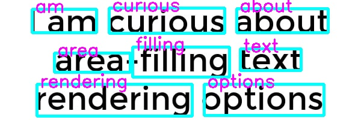
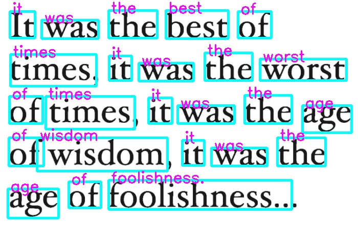

# Sistema de Reconocimiento Óptico de Caracteres y Conversión a ASCII

Este proyecto desarrolla un sistema que detecta, reconoce y convierte texto de imágenes a formato ASCII utilizando técnicas de aprendizaje profundo. El sistema se integra con un bot de Telegram para recibir y procesar imágenes enviadas por los usuarios.

## Descripción

El sistema utiliza dos modelos principales:
- **SSD VGG**: Para la detección de palabras en imágenes.
- **CRNN**: Para el reconocimiento de palabras y su conversión a texto.

El proyecto se ha implementado en las plataformas de hardware Jetson Nano 2GB y Jetson AGX Xavier para evaluar su rendimiento.

## Características

- Detección y reconocimiento de texto en imágenes.
- Integración con un bot de Telegram para la interacción del usuario.
- Preprocesamiento de imágenes utilizando OpenCV.
- Optimización del modelo utilizando TensorRT.

## Resultados

### Texto Impreso en Fondos Uniformes

El sistema mostró una alta precisión en la detección y reconocimiento de texto en fondos uniformes.

| Imagen       | Texto Real                                                                          | Texto Reconocido                                                          |
|--------------|-------------------------------------------------------------------------------------|-------------------------------------------------------------------------  |
| Imagen (a)   | "I am curious about area-filling text rendering options"                            | "am curious about area filling text rendering options"                    |
| Imagen (b)   | "It was the best of times, it was the worst of times, it was the age of wisdom, ..."| "it was the best of times it was the worst of times it was the age of ..."|

### Texto Impreso en Fondos Complejos

El rendimiento fue ligeramente inferior en fondos complejos, pero la mayoría de las palabras fueron reconocidas correctamente.

| Imagen       | Texto Real                                                   | Texto Reconocido                                                            |
|--------------|--------------------------------------------------------------|-----------------------------------------------------------------------------|
| Imagen (a)   | "live life with no excuses, travel with no regret".          | "live life with no exlises travel with regre 'oscar wilde"                  |
| Imagen (b)   | "we travel not to escape life, but for life not to escape us"| "ravel not escape le, butforlife ife net to escape us coraltrave"           |

## Conclusiones y Mejoras Futuras

### Conclusiones

El proyecto "Sistema de Reconocimiento Óptico de Caracteres y Conversión a ASCII" ha demostrado ser una solución efectiva para la digitalización de texto a partir de imágenes utilizando técnicas de aprendizaje profundo. El sistema mostró una alta precisión en la detección y reconocimiento de texto impreso en fondos uniformes y complejos. Sin embargo, se observaron algunas limitaciones en el reconocimiento de texto escrito a mano y en condiciones de iluminación adversas.

### Mejoras Futuras

Para mejorar el rendimiento y la precisión del sistema, se pueden considerar las siguientes acciones:

1. **Implementación de Corrección Post-proceso**: Desarrollar un modelo adicional de procesamiento de lenguaje natural (NLP) para revisar y corregir las predicciones de texto, mejorando así la coherencia y exactitud del texto reconocido.

2. **Aumento y Diversificación de Datos de Entrenamiento**: Incrementar el conjunto de datos de entrenamiento con más ejemplos de texto escrito a mano y en diversas condiciones de iluminación puede ayudar a los modelos a generalizar mejor.

3. **Optimización del Preprocesamiento de Imágenes**: Mejorar las técnicas de preprocesamiento, como la normalización de iluminación y la eliminación de ruido, puede aumentar la calidad de las entradas al sistema y la precisión del reconocimiento de texto.

4. **Exploración de Nuevas Arquitecturas de Modelos**: Investigar y probar nuevas arquitecturas de redes neuronales, como las redes con atención o las redes generativas adversarias (GANs), podría ofrecer mejoras adicionales en la precisión y eficiencia del sistema.

Estas mejoras pueden abordar las limitaciones actuales y llevar a un sistema de OCR más robusto y preciso.

## Referencias

- **IAM Handwriting Database**: Esta base de datos contiene más de 115,000 palabras escritas a mano por 657 escritores, proporcionando un recurso valioso para el entrenamiento de modelos de reconocimiento de escritura a mano. [IAM Database](https://fki.tic.heia-fr.ch/databases/iam-handwriting-database)
- **SynthText**: Esta base de datos genera texto sintético superpuesto en imágenes naturales, lo cual es útil para entrenar modelos de detección de texto en escenarios del mundo real. [SynthText](https://github.com/ankush-me/SynthText)
- **SynthTiger**: Esta base de datos sintetiza imágenes de texto en diversos fondos y contextos, facilitando el entrenamiento de modelos en una amplia gama de escenarios. [SynthTiger](https://github.com/clovaai/synthtiger)
- **GNHK Handwriting Dataset**: Esta base de datos de GoodNotes incluye una variedad de muestras de escritura a mano, que ayudan a entrenar y evaluar modelos en el reconocimiento de escritura a mano. [GNHK Dataset](https://www.goodnotes.com/gnhk)
- **SSD VGG**: [PyTorch-SSD](https://github.com/qfgaohao/pytorch-ssd)
- **CRNN**: [CRNN-PyTorch](https://github.com/GitYCC/crnn-pytorch)